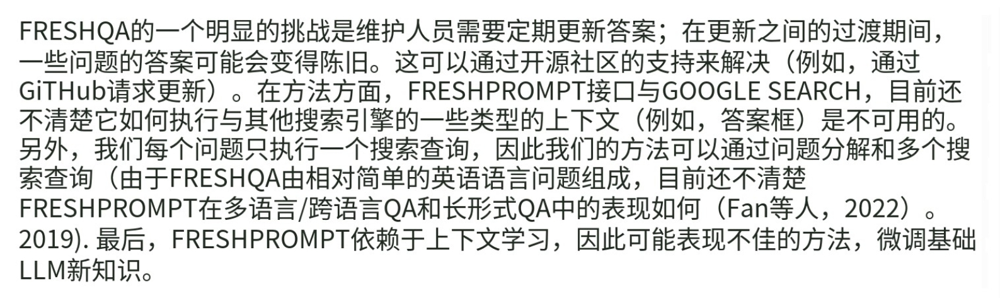

# 实训调研

## 0429-0505

### RAG

RAG是大模型输出进行优化，引用训练数据来源之外的权威知识库。RAG的定义：https://aws.amazon.com/cn/what-is/retrieval-augmented-generation/

RAG的工作原理：（引入了一个信息检索组件，利用用户输入首先从新数据源提取信息，用户查询和相关信息提供给LLM，LLM用新的知识和训练数据创建更好的响应。）

1. 创建外部数据：如文件、数据库记录、长文本或者嵌入语言模型的AI技术将数据转换为数字表示形式将其存储在向量数据库。
2. 检索相关信息：数据查询将转换为向量表示形式，并和向量数据库匹配。
3. RAG模型通过上下文添加检索到的相关数据来增强用户输入。使用提示工程技术与LLM有效沟通。
4. 更换外部数据。

幻觉是模型生成的文本不遵循原文、不符合事实。https://zhuanlan.zhihu.com/p/642648601

解决模型幻觉的方法之一是检索增强。

检索增强：https://www.zhihu.com/search?type=content&q=%E6%A3%80%E7%B4%A2%E5%A2%9E%E5%BC%BA

AIGC的检索增强技术综述：https://zhuanlan.zhihu.com/p/684879771

LLM+RAG：https://zhuanlan.zhihu.com/p/651380539

RAG的好处：https://www.zhihu.com/question/625481187/answer/3309968693

检索+提示：https://zhuanlan.zhihu.com/p/470784563

### 搜索引擎/知识图谱

向量搜索引擎：https://www.51cto.com/article/779593.html

- 图像相似性搜索
- 反向图像搜索
- 对象相似性搜索
- 稳健型OCR文档搜索
- 语义搜索
- 跨模型检索
- 探索感知相似性
- 比较模型表示
- 概念插值
- 概念空间遍历

基于知识图谱的LLM检索增强方法：https://zhuanlan.zhihu.com/p/683229102

大模型+检索增强：

1. 检索增强模型Atlas，论文题目:Few-shot Learning with Retrieval Augmented Language Models
2. **REPLUG**模型可以说是**“黑盒”式检索增强**的代表。在这种新范式下，语言模型是一个黑盒子（它的参数被冻结了，不会被更新优化），**检索组件才是可微调的部分**。
3. 通过检索Wikipedia帮助OpenQA

## 0506-0513

参考论文：

[1] FreshLLM：https://arxiv.org/pdf/2310.03214，GitHub：https://github.com/freshllms/freshqa

拆解claim：

[1] Mitigating Large Language Model Hallucinations via Autonomous Knowledge Graph-Based Retroftting（AAAI2024）：
[2] FLEEK: Factual Error Detection and Correction with Evidence Retrieved from External Knowledge（EMNLP2023）：https://aclanthology.org/2023.emnlp-demo.10.pdf
[3] FacTool: Factuality Detection in Generative AI -- A Tool Augmented Framework for Multi-Task and Multi-Domain Scenarios：https://arxiv.org/pdf/2307.13528
[4] Verify-and-Edit: A Knowledge-Enhanced Chain-of-Thought Framework（ACL2023）：https://aclanthology.org/2023.acl-long.320.pdf

## 0513-0520

研读论文并调试模型：
FreshLLM：https://arxiv.org/pdf/2310.03214，GitHub：https://github.com/freshllms/freshqa

审稿页面：https://openreview.net/forum?id=q38SZkUmUh

摘要：LLM训练一次，从来不更新，缺乏动态适应我们不断变化世界的能力。我们在回答测试当前世界知识的背景下对LLM生成的文本真实性进行详细研究。介绍FRESHQA，一种新的动态QA基准涵盖了各种各样的问题和答案类型，包括需要快速变化的世界知识的问题，以及需要揭穿的错误前提的问题。并提出FRESHPROMPT，提升了FRESHQA的LLM表现，通过将相关的和这一新的资料从搜索引擎检索增强的提示方法（如搜索引擎提示方法Press et al. 2022：https://arxiv.org/pdf/2210.03350）。

贡献：

1. 提出新的动态QA基准，叫FRESHQA，具有一组不同的问题和答案类型，包括问题的答案可能会随着时间的推移和问题的处境事实上是不正确的。
2. 在fast-changing, false-premise, multi-hop问题上struggle。我们的双评估模式捕捉到了由诸如连锁思维提示。
3. FRESHPROMPT是一种简单的上下文学习方法，与检索增强方法相比，通过有效来自搜索引擎的事实和最新信息整合到模型的提示中，提高LLM的真实性。

限制和未来工作：



结论：


## 0521-0527

本周我们主要的工作是调通搜索引擎模块的模型。最终的结果是将三个ipynb文件调通并且正常运行，并设计多个测试用例测试freshprompt功能，**证明了其利用RAG解决了大模型幻觉问题**。
我们主要是为了解决大模型的幻觉问题，因此我们采用了RAG技术，也就是基于搜索引擎，根据其搜索的内容进行LLM内容的实时更新。

我们基于的是**freshllm**的论文（https://arxiv.org/abs/2310.03214），并对论文的部分代码进行了修改。为了便于测试，我们将输入文件和输出文件都保存在本地，并且设计测试用例进行测试。

**遇到的困难**：在调试relax和strict模块时，遇到了一些问题。如colab安装包难以安装等，最后将文件都放在本地进行，则顺利运行。

**各个文件解释：**

1. **freshprompt.ipynb**:主要是算法核心，一种基于RAG的大语言模型，可以根据最新的搜索到的信息进行回答。
2. **fresheval_strict**和**fresheval_relaxed.ipynb**都是评估的函数。
   「RELAXED」模式只衡量主要答案是否正确，「STRICT」模式则衡量回答中的所有说法是否都是最新的事实（即没有幻觉）。两者的区别主要在于prompt的不同。
3. **fresheval_strict_sample_evaluation_spreadsheet - freshqa.csv** 为用于「STRICT」模式的输入数据集；**fresheval_relaxed_sample_evaluation_spreadsheet - freshqa.csv** 为用于「RELAXED」模式的输入数据集；
4. **main.py**为爬虫腾讯网和搜狐网的信息代码，后期看下是否需要。@lfh


freshllm的代码示例：（见freshprompt.ipynb）

```
#@title Demonstration examples


demo_questions = [
    "What year is considered Albert Einstein's annus mirabilis?",
    "Which photographer took the most expensive photograph in the world?",
    "How many days are left until the 2023 Grammy Awards?",
    "How many years ago did the Boxing Day Tsunami happen?",
    (
        "When did Amazon become the first publicly traded company to exceed a"
        " market value of $3 trillion?"
    ),
]

concise_demo_reasonings_and_answers = [
    (
        "1905 is considered Albert Einstein's annus mirabilis, his miraculous"
        " year."
    ),
    (
        'The most expensive photograph in the world is "Le Violon d\'Ingres".'
        " The photograph was created by Man Ray."
    ),
    (
        "The 2023 Grammy Awards ceremony was held on February 5, 2023. Thus,"
        " the ceremony has already taken place."
    ),
    (
        "The disaster occurred on December 26, 2004. Thus, it happened 19 years"
        " ago."
    ),
    "Amazon's market capitalization has never exceeded $3 trillion.",
]

verbose_demo_reasonings_and_answers = [
    (
        "In the year of 1905, Albert Einstein published four groundbreaking"
        " papers that revolutionized scientific understanding of the universe."
        " Thus, scientists call 1905 Albert Einstein's annus mirabilis — his"
        " year of miracles."
    ),
    (
        "Man Ray's famed \"Le Violon d'Ingres\" became the most expensive"
        " photograph ever to sell at auction, sold for $12.4 million on May"
        " 14th, 2022 at Christie's New York. The black and white image, taken"
        " in 1924 by the American surrealist artist, transforms a woman's naked"
        " body into a violin by overlaying the picture of her back with"
        " f-holes. Thus, Man Ray is the photographer who took the most"
        " expensive photograph in the world."
    ),
    (
        "The 2023 Grammy Awards, officially known as the 65th Annual Grammy"
        " Awards ceremony, was held in Los Angeles on February 5, 2023. Thus,"
        " the event has already taken place."
    ),
    (
        "The Boxing Day Tsunami refers to the 2004 Indian Ocean earthquake and"
        " tsunami, which is one of the deadliest natural disasters in recorded"
        " history, killing an estimated 230,000 people across 14 countries. The"
        " disaster occurred on December 26, 2004, which is 19 years ago."
    ),
    (
        "Amazon's market capitalization hit a peak of roughly $1.9 trillion in"
        " July 2021. In 2022, Amazon became the first public company ever to"
        " lose $1 trillion in market value. Thus, Amazon's market value has"
        " never exceeded $3 trillion. In fact, Apple became the first publicly"
        " traded U.S. company to exceed a market value of $3 trillion in"
        " January 2022."
    ),
]

prefix = (
    f"\nanswer: As of today {current_date}, the most up-to-date and relevant"
    " information regarding this query is as follows. "
)

concise_demo_reasonings_and_answers = [
    prefix + x for x in concise_demo_reasonings_and_answers
]
verbose_demo_reasonings_and_answers = [
    prefix + x for x in verbose_demo_reasonings_and_answers
]


```


freshprompt的运行结果：（能够进行跑通）

test1：测试格莱美奖


test2：测试中国现在的chairman


test3：测试美国现在的总统


结论：可以作为基于RAG的LLM系统，解决大模型幻觉问题。


**下周的工作设想**

将算法都写成def函数形式，整合到后端去。以及讨论一下项目还需要做的工作：比如如何凸显出对比系统这一概念；之后再结合前端形成完整系统。

## 0528-0602

原设计：主要对ipynb文件改成了.py文件。并且将这些代码保存在了四个.py文件中。

分别是：

dateSolution.py：对判断是否日期和日期的格式化。

finallinkSolution.py：对于网页爬取，link处理等函数。

finalmainSolution.py：调用api的函数以及主函数。

formatSolution.py：format格式化相关的函数。

后进行更改。代码地址为：

后因为包的导入冲突问题，故先进行算法的优化以及成功运行。

目前的文件为Thetttask.py和同名的ipynb函数。可以运行成功。与前面的代码所作出的更改为：

1. 对prompt做出了硬编码（freshprompt_demo）：做出更改的原因是：我们的模型是由prompt+question的。但是我们只需要对question进行格式化以及检索增强，而prompt可以先设置为已进行检索增强后的示例，而不用耗费api检索成本进行。【做出的创新点】因此将prompt转化为硬编码格式进行embedding。

```python
freshprompt_demo="""
query: What year is considered Albert Einstein's annus mirabilis?

source: quora.com
date: None
title: What caused Einstein's annus mirabilis?
snippet: No. He was smarter. He was so smart that “they” are probably fundamentally incapable of understanding just how “smart” Einstein was. Around 1900, Lord Kelvin, a physicist so brilliant they named a unit after him, famously recommended that young students not study physics, because so little remained to be done. He listed, specifically, two remaining issues to be solved, after which all that remained was to do ever better measurements: the photoelectric effect and the absence of a result in the Michelson-Morley experiment. He might well have added the Ultraviolet Catastrophe. Einstein was the person who solved both those riddles (and the Ultraviolet Catastrophe in the bargain), and the answers were what 20th century physics was all about: relativity and quantum mechanics. These two are arguably the most profound breakthroughs in our understanding of the world around us in all of human history. He basically single-handedly created modern physics. And in addition to that, there is basic…
highlight: None

source: bbvaopenmind.com
date: Jun 30, 2015
title: Einstein's Miracle Year - BBVA OpenMind
snippet: Einstein's miraculous year: 1905. He published four key studies for our current conception of different aspects of reality: light, matter, ...
highlight: 1905

source: guides.loc.gov
date: Nov 06, 2019
title: Introduction - Annus Mirabilis of Albert Einstein
snippet: In 1905 Albert Einstein published four groundbreaking papers that revolutionized scientific understanding of the universe.
highlight: 1905

source: cantorsparadise.com
date: Jul 18, 2023
title: Einstein's Miraculous Year: A Summary of the 1905 Annus ...
snippet: These are the four papers that Albert Einstein published in 1905, which are considered to be the foundation of modern physics.
highlight: 1905

source: guides.loc.gov
date: Jan 26, 2024
title: The 1905 Papers - Annus Mirabilis of Albert Einstein
snippet: It is an English translation of all his writings, while the second book is where the four 1905 papers were published in the original German. For ...
highlight: 1905

question: What year is considered Albert Einstein's annus mirabilis?
answer: As of today May 27, 2024, the most up-to-date and relevant information regarding this query is as follows. 1905 is considered Albert Einstein's annus mirabilis, his miraculous year.


query: Which photographer took the most expensive photograph in the world?

source: en.wikipedia.org
date: None
title: List
snippet: 
Rank,Artist,Date
1,Man Ray,May 14, 2022
2,Edward Steichen,Nov 10, 2022
3,Andreas Gursky,November 8, 2011
4,Richard Prince,May 12, 2014
highlight: None

source: all-about-photo.com
date: Dec 22, 2019
title: Most expensive photographs ever sold | Photo Article
snippet: The most expensive photo in history as of December 2014 is $6.5 million! The work of Australian landscape photographer Peter Lik, Phantom is a ...
highlight: Australian landscape photographer Peter Lik, Phantom

source: all-about-photo.com
date: Dec 20, 2022
title: Was the most expensive photograph ever taken was sold for $22 million?
snippet: The most expensive image ever sold at auction, Le Violon d'Ingres (1924) by Man Ray, which features a nude woman's back superimposed with a violin's f-holes, sold for $12.4 million on May 14th, 2022 at Christie's New York.
highlight: None

source: barnebys.com
date: May 15, 2023
title: The 11 Most Expensive Photographers
snippet: From Vogue icon Helmut Newton to feminist art pioneer Cindy Sherman, these photographers have produced indelible images that command equally ...
highlight: Vogue icon Helmut Newton

source: artisanhd.com
date: Dec 19, 2023
title: Top 5 Most Expensive Photographs & Why We Love Them
snippet: Our Top 5 Favorite Most Expensive Photographs · Andreas Gursky: Rhein II (1999) – $4.3M · Edward Steichen: The Flatiron – $11.8M · Richard Prince: ...
	4.7store rating (134)
	‎Free 3–9 day delivery
	‎10
	day returns
highlight: Andreas Gursky: Rhein II

question: Which photographer took the most expensive photograph in the world?
answer: As of today May 27, 2024, the most up-to-date and relevant information regarding this query is as follows. The most expensive photograph in the world is "Le Violon d'Ingres". The photograph was created by Man Ray.


"""

```

2. 对url的提取进行函数编写，并且根据questions_and_answers这一属性的异常进行检测（需要考虑的点，不然会报错影响运行）：

```python

# 提取Link url
def exact_link_url(question, url_count):
    search_data = call_search_engine(question)
    url_list = []

    # 确认'questions_and_answers'字段存在并且是列表
    if 'questions_and_answers' in search_data and isinstance(search_data['questions_and_answers'], list):
        # 计算实际可用的结果数量
        available_count = min(url_count, len(search_data['questions_and_answers']))

        for i in range(available_count):
            search_result = search_data['questions_and_answers'][i]
            if "link" in search_result:
                source = search_result["link"]
                url_list.append(source)
    
    return url_list
```

3. 模型的最终效果（运行Thetttask.ipynb）


4. 为了对这一模型进行理解和展示，做出的模型图：


下周工作：对前后端进行设计和完善，争取做出完整的系统。
